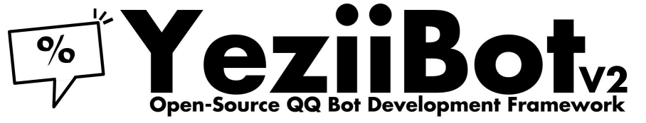

# YeziiBot v2 [](https://www.codefactor.io/repository/github/lovelya72/yeziibot-v2) [](https://www.gnu.org/licenses/agpl-3.0) [](https://cqp.me)



YeziiBot-v2基于kjBot v2 legacy开发，是一个轻量级多功能的酷Q机器人。

## 请使用CoolQ Pro
本项目开发目标为CoolQ Pro。为获得最好的效果，请您使用CoolQ Pro运行本项目。[从这里购买属于你的酷Q Pro许可证！](https://cqp.me)

## 框架结构

```
/
|--SDK/ #kjBot\SDK
|--public/
    |--tools/ #各类开放函数的文件
    |--index.php #入口文件
    |--init.php #初始化用
    |......
|--vendor/ #包目录
|--storage/ #请确保运行 PHP 的用户具有这个文件夹的写权限
    |--data/ #数据文件夹
        |--error.log #如果出现异常未捕获则会在此存放日志
        |......
    |--cache/ #缓存文件夹
|--middleWare/ #中间件，用于处理非命令
    |--Chain.php #中间件链，用于调整中间件顺序以及启用状态
    |--......
|--module/ #在这里开始编写你的模块吧 :)
    |--......
|--config.ini.example #配置文件样例，本地部署时请复制为 config.ini 并根据实际情况调整
|--build.sh #进行环境配置
|--run.sh #一键部署（大概 :v
```

## 上手

### 快速安装

```sh
git clone https://github.com/kj415j45/kjBot.git
cd kjBot/
./build.sh
```

仅作为框架使用时请清除 `composer.json` 内的 `require` 以及 `module/`、`middleWare/` 文件夹内的全部内容。

### 入门

`public/init.php` 中存在一个全局变量区供编写模块的程序员使用，约定本框架产生的全局变量均为大写字母开头。  
`public/tools/` 下的文件将为框架扩展各类方法，请仔细阅读。

### 编写第一个模块

假定该模块为 `hello/main.php` ，向 bot 发送 `!hello` 即可触发该模块。
```php
<?php

global $Queue; //从全局变量区中导入 $Queue 数组，该数组提供消息队列的功能

if(!fromGroup()){ //如果消息不是来自群聊
    $Queue[]= sendBack('Hello, world!'); //向消息队列尾插入一句 'Hello, world!'，在哪收到就发到哪，此处只会在私聊中发送
}else{
    leave(); //从模块中退出，不再执行下面的语句
}

?>
```

### 编写更多模块

参考 `module/` 文件夹下的其他模块

## 代码要求
1. 当修改或添加文件时，请在文件的头部添加```YeziiBot-v2.licenseheader```里面的许可证文字
2. 不推荐在文件尾部使用```?>```关闭```<?php```

## 感谢

- [richardchien/coolq-http-api](https://github.com/richardchien/coolq-http-api)
  - 酷Q 与许多 Bot 之间的桥梁
- [kilingzhang/coolq-php-sdk](https://github.com/kilingzhang/coolq-php-sdk)
  - 本项目的起源
- [kj415j45/jkBot](https://github.com/kj415j45/jkBot)
  - 本项目的零代
- 框架作者
  - [kj415j45](https://github.com/kj415j45)
- 贡献者
  - [Cyanoxygen](https://github.com/Cyanoxygen)
  - [Baka-D](https://github.com/Baka-D)
  - [lslqtz](https://github.com/lslqtz)

## LICENSE

除非文件内另有声明，YeziiBot 框架及 SDK 均为 MIT 协议。但是模块与中间件均为 AGPL 协议，如果您希望闭源开发，请不要使用该项目提供的模块和中间件。
